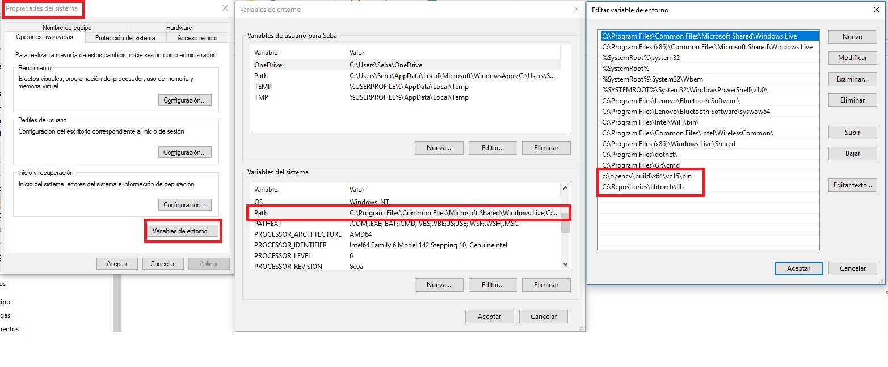

# Environment
Librerías utilizadas, configuración e instalación


## PyTorch
### Install
Download: [PyTorch](https://pytorch.org/get-started/locally/)

#### Windows
PyTorch Build: ```Stable (1.4)```

Your SO: ```Windows```

Packge: ```LibTorch```

Language: ```C++/Java```

CUDA: ```None```

#### Linux
PyTorch Build: ```Stable (1.5)```

Your SO: ```Linux```

Packge: ```Pip```

Language: ```C++/Java```

CUDA: ```None```

Run this Command: ```pip install torch==1.5.0+cpu torchvision==0.6.0+cpu -f https://download.pytorch.org/whl/torch_stable.html```


## OpenCV
Download: [Source Forge](https://sourceforge.net/projects/opencvlibrary/)
Pasos para intalar OpenCv en Visual.

[Instalar python en windows](https://www.python.org/downloads/)
Instalar Visual Studio con el pack de phyton incluido (hay que marcalo)
[Instalar Git(Opcional)](https://git-scm.com/downloads)

[Adding OpenCV 4.2.0 to Visual Studio 2019 project in Windows using pre-built binaries+](https://medium.com/@subwaymatch/adding-opencv-4-2-0-to-visual-studio-2019-project-in-windows-using-pre-built-binaries-93a851ed6141)

Seguir los pasos con la antenicon puesta a la configuracion dentro del unproyecto nuevo dentro de visual, para que
encuentre las librerias y linkee corractamente.

## Configuración de sistema
Cómo configurar la variable de entorno de Windows para incluir las DLL en la variable PATH:

__Nota: Luego de realizar esta modificación el Visual Studio debe ser abierto nuevamente para que lo tome__

